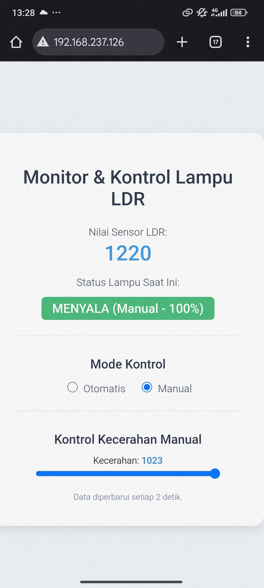
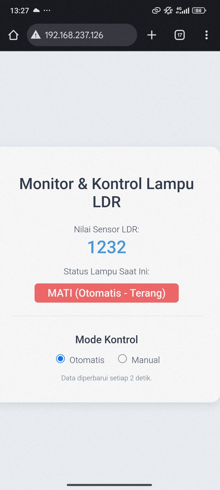

# 💡 Smart Lighting Berbasis ESP32

**KELOMPOK 9**  
- 105222039 | Nizar Afham Aflaha  
- 105222041 | Muhammad Rizqi Ferdhinandito

Sistem **Smart Lighting** ini menggunakan **ESP32 dan sensor cahaya (LDR)** untuk mengontrol lampu secara otomatis berdasarkan tingkat pencahayaan lingkungan sekitar. Lampu akan **menyala secara perlahan saat gelap** dan **padam secara perlahan saat terang**, menciptakan sistem pencahayaan yang efisien dan ramah lingkungan.

---

## Keterkaitan dengan Sustainable Development Goals (SDGs) 🌍

Proyek ini mendukung beberapa poin dalam Tujuan Pembangunan Berkelanjutan (SDGs):

###  **SDG 7 – Energi Bersih dan Terjangkau**
- Mengurangi pemborosan listrik dengan mengotomatisasi pencahayaan.
- Mengoptimalkan konsumsi energi melalui sistem efisien.

###  **SDG 11 – Kota dan Permukiman yang Berkelanjutan**
- Mendorong pembangunan infrastruktur rumah cerdas (**smart home**).
- Meningkatkan kualitas hidup dengan pencahayaan otomatis yang adaptif.

###  **SDG 13 – Penanganan Perubahan Iklim**
- Penghematan listrik → mengurangi emisi karbon tidak langsung.
- Kontribusi kecil namun konsisten terhadap mitigasi perubahan iklim.

---

##  Komponen

| Komponen                  | Jumlah | Keterangan                                |
|---------------------------|--------|--------------------------------------------|
| ESP32 Dev Board           | 1      | Mikrokontroler utama                       |
| Sensor LDR (Light Sensor) | 1      | Mengukur intensitas cahaya sekitar         |
| Resistor 10K Ohm          | 1      | Pull-down resistor untuk LDR               |
| LED (atau lampu via relay)| 1      | Simulasi lampu teras                        |
| Breadboard & Kabel Jumper | -      | Untuk merakit sirkuit                      |
| (Opsional) Relay Module   | 1      | Untuk kontrol lampu AC (220V) secara aman  |

---

##  Konsep Proyek

1. **Pembacaan Cahaya**: Sensor LDR membaca tingkat pencahayaan luar ruangan.
2. **Logika Otomatisasi**:
   - Saat gelap → lampu menyala perlahan (**fade in**)
   - Saat terang → lampu padam perlahan (**fade out**)
3. **Kontrol PWM**: Digunakan untuk transisi yang halus menggunakan fitur PWM pada ESP32.
4. **Monitoring**: Sistem ini akan dikembangkan dengan integrasi dashboard **Website** untuk pemantauan jarak jauh.

---

##  Skema Sederhana

```plaintext
ESP32                                     Breadboard
  |                                           |
3V3 ------> LDR Modul (VCC)                   |
GND ------> Jalur Ground (-) ------------------+--- LDR Modul (GND)
  |         (pada breadboard)                  |
D34 ------> LDR Modul (AO)                     +--- LED Katoda (-)
  |                                            |       ^
D2  ------> [Resistor 220Ω] ------> LED Anoda (+)      |
                                                       |
                                       (Jalur Ground pada Breadboard)
```
---
##  Diagram Blok Sistem


---
##  User Interface

<table>
  <tr>
    <td align="center">
      
      <br />
      <em>UI Manual</em>
    </td>
    <td align="center">
      
      <br />
      <em>UI Otomatis</em>
    </td>
  </tr>
</table>
